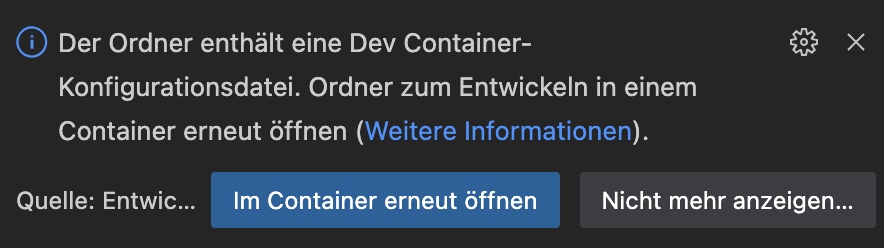

# open-sensor-platform
Hardware Designs and Firmware of the Open Sensor Platform


## Installation

## Development Environment Setup

### Using VS Code Dev Container

The easiest way to get started with development is to use VS Code's Dev Container feature. This ensures a consistent development environment across all developers.

1. Install [VS Code](https://code.visualstudio.com/)
2. Install the [Remote - Containers](https://marketplace.visualstudio.com/items?itemName=ms-vscode-remote.remote-containers) extension
3. Open the project in VS Code
4. When prompted, click "Reopen in Container" or use the command palette (F1) and select "Remote-Containers: Reopen in Container"



The container will be built and started automatically. This might take a few minutes on the first run.
The container includes all required dependencies like the ESP-IDF toolchain, QEMU emulator, and Zig compiler.

### Using the Dev Container without VS Code
If you are not using VS Code or just want to compile from the commandline you can enter the container like this:
```
cd dev_docker
docker compose run development -- /bin/bash
```

### Build & Flash
As soon as you have an active terminal session in the container, or installed the IDF 5.4 toolchain locally on your system, you can build the project like this:
```
make prepare # This prepares the build environment only needs to be run once!
make # This runs the default build_firmware command
```
The current Dev Container setup does not support flashing the board.
To flash the board open a different terminal (not running in the container) and type:
```
make flash_monitor
```

### tio
- MacOS: `brew install tio`
- Linux: Use your system package manager
- Windows: Using msys2: `pacman -S tio`

Exit tio: `ctrl+t q`


